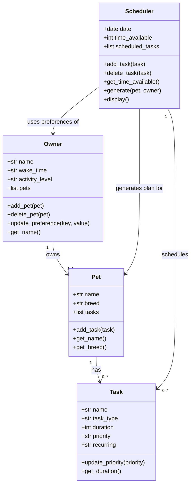

# PawPal+ Project Reflection

## 1. System Design

Three core actions:
User can register pets
Generate tasks for pet
Track task progress

**a. Initial design**

- Briefly describe your initial UML design.
- What classes did you include, and what responsibilities did you assign to each?
Four classes: Owner, Pet, Task, DailyPlan
Owner needs name, pet, preferences. Should be able to add pet, delete pet, update preference, and get name.
Pet need name, type, DailyPlan. Should be able to get name, get type, and retrieve DailyPlan/generate as well
DailyPlan/Scheduler need tasks, time_available. Should be able to add tasks, delete tasks, get time available.
Task need priority, duration. Should be able to update priority, and get duration.

**b. Design changes**

Yes, the design changed significantly after reviewing the initial skeleton for missing relationships and logic gaps.

1. **Tasks moved from `Scheduler` to `Pet`.** In the initial design, `Pet` held a reference to `Scheduler` and tasks only existed inside the plan. This meant there was no way to define or store tasks for a pet before scheduling. The revised design gives `Pet` a `list tasks` with `add_task()`, so tasks are defined on the pet first and the scheduler selects from them.

2. **`generate()` moved from `Pet` to `Scheduler`.** The README requires scheduling to consider both pet tasks and owner preferences (time available, wake time, activity level). `Pet.generate()` had no reference to `Owner`, making it impossible to apply those constraints. Moving `generate(pet, owner)` to `Scheduler` gives it access to both, which matches the README's requirement to produce a plan based on constraints and priorities.

3. **Owner preferences made explicit.** The initial `Owner` had a generic `preferences` field. The revised design breaks this into concrete attributes — `wake_time` and `activity_level` — which are the specific inputs the scheduler needs to produce a time-slotted plan like the sample output in the README (`08:00 — Morning walk`).

4. **`Task` gained `name`, `task_type`, and `recurring`.** The README lists task types (walks, feeding, meds, enrichment, grooming) and mentions daily vs. weekly recurrence in the scheduling table. These fields were missing from the initial design and are needed to implement filtering and recurring task logic.

---

## 2. Scheduling Logic and Tradeoffs

**a. Constraints and priorities**

- What constraints does your scheduler consider (for example: time, priority, preferences)?
- How did you decide which constraints mattered most?

1. **Time budget** — `Scheduler(time_available)` sets the total minutes available for the day. The scheduler tracks `remaining` minutes and stops adding tasks once a task's duration (plus a 5-minute buffer) would exceed what's left. This is the hard outer limit; everything else operates within it.

2. **Task priority** — each task is tagged `high`, `medium`, or `low`. Tasks are sorted by priority before any time slots are assigned, so high-priority tasks (feeding, meds) are always scheduled first and low-priority ones (enrichment) are the first to be dropped when time runs short.

**b. Tradeoffs**

- Describe one tradeoff your scheduler makes.
- Why is that tradeoff reasonable for this scenario?

The scheduler uses a **greedy priority-first strategy**: it sorts all pending tasks by priority (then by shortest duration as a tiebreaker) and slots them one by one until time runs out. Any task that does not fit is skipped entirely — the scheduler never goes back to swap in a shorter lower-priority task that might have fit in the remaining gap.

For example, if 10 minutes remain and the next task takes 15 minutes, the scheduler skips it and also skips every task after it, even if the very next task is only 5 minutes long and would fit.

This tradeoff is reasonable for a daily pet care context because:
- **Priority is the primary constraint.** An owner who cannot finish everything should drop low-priority enrichment tasks, not squeeze them in ahead of high-priority meds or feeding.
- **Simplicity matters.** A backtracking or knapsack algorithm would find a globally optimal fit, but it is significantly more complex to implement, test, and explain. For a small number of daily tasks (typically under 10), the greedy approach produces a good-enough plan with predictable, easy-to-trace behaviour.
- **The tiebreaker partially compensates.** Sorting same-priority tasks by shortest duration first ("shortest job first") naturally packs more tasks into the available window, recovering much of the efficiency lost by not backtracking.

---

## 3. AI Collaboration

**a. How you used AI**

- How did you use AI tools during this project (for example: design brainstorming, debugging, refactoring)?
- What kinds of prompts or questions were most helpful?

**b. Judgment and verification**

- Describe one moment where you did not accept an AI suggestion as-is.
- How did you evaluate or verify what the AI suggested?

---

## 4. Testing and Verification

**a. What you tested**

- What behaviors did you test?
- Why were these tests important?

**b. Confidence**

- How confident are you that your scheduler works correctly?
- What edge cases would you test next if you had more time?

---

## 5. Reflection

**a. What went well**

- What part of this project are you most satisfied with?

**b. What you would improve**

- If you had another iteration, what would you improve or redesign?

**c. Key takeaway**

- What is one important thing you learned about designing systems or working with AI on this project?
